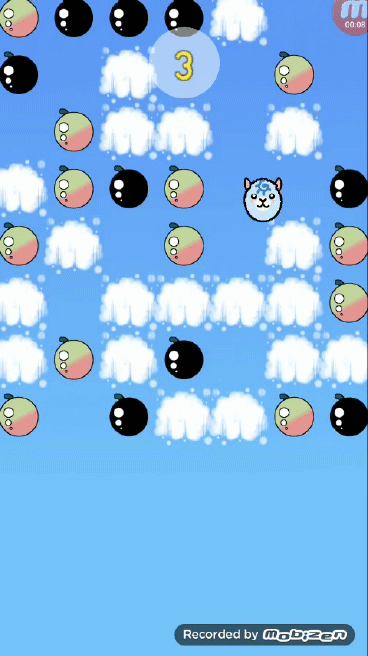

# UnityAirpacaGame
2D Android game

(Screen recorded from an Android cellphone)

This game is a work-in-progress hobby project.

Game Details:

Objective:  
-To collect as many colored berries as possible before falling out of the sky (game over)

Mechanics:  
-Player sprite touching a colored berry earns the player 1 point  
-Player sprite touching a black berry (bomb) knocks the player out of the sky, resulting in game over  
-Player sprite falling below the bottom of the screen results in game over  
-Player sprite releasing spit removes all berries in the spit's trajectory from the screen  

Controls:  
-Tap the screen above the player sprite to make it jump  
-Tap the screen below the player sprite to make it release spit  

